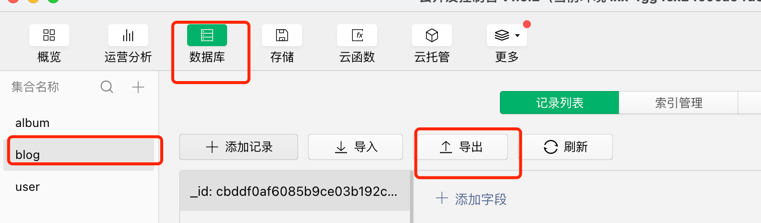
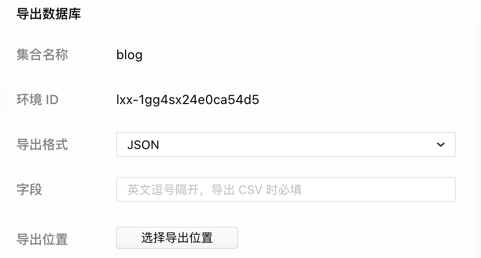
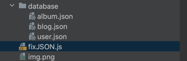
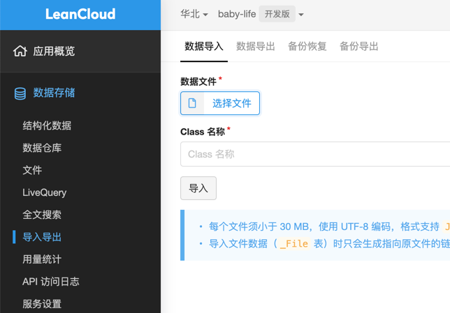
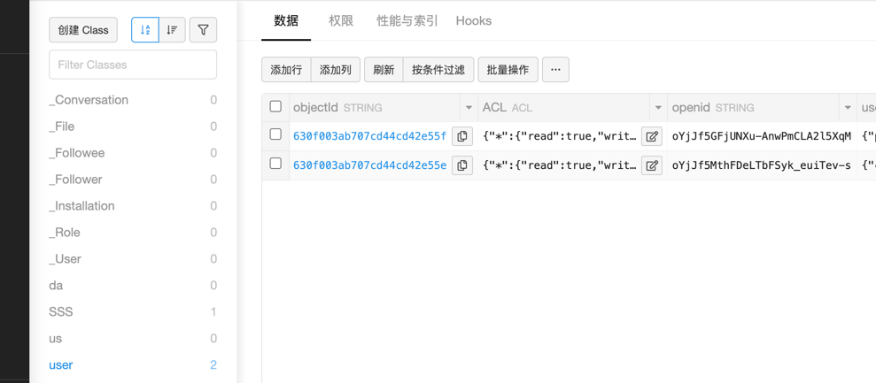
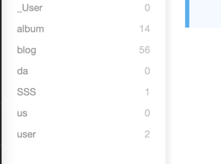
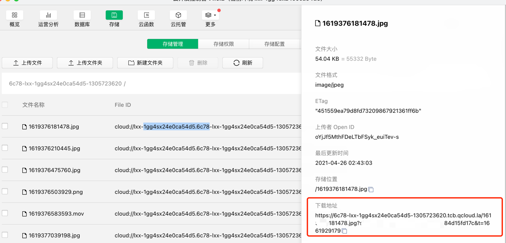
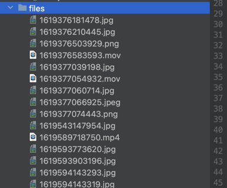
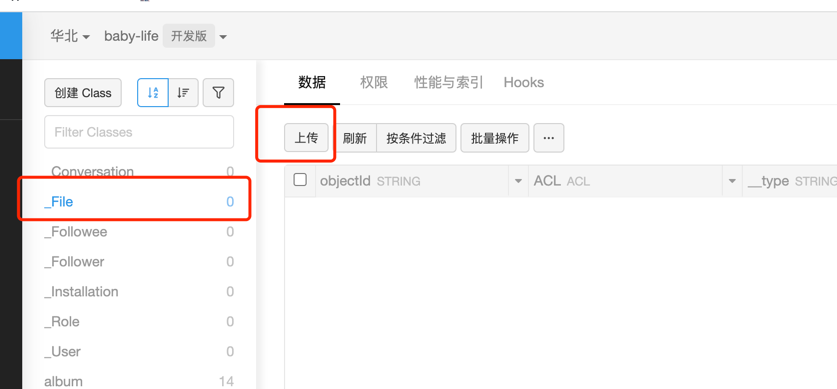
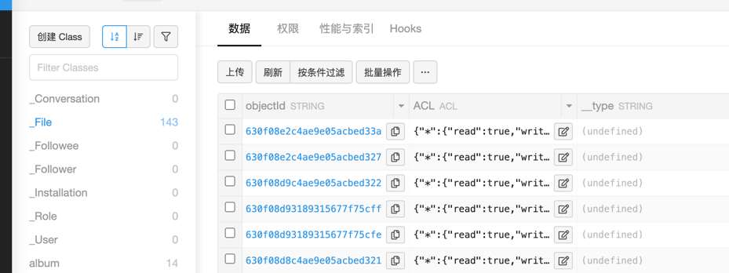

# 迁移微信云开发的数据到Leancloud
由于[微信云开发计费调整公告](https://developers.weixin.qq.com/community/minihome/doc/0000a680588d3891fa2ec250c51401), 费用较高，所以我想要迁移之前的云开发数据到leancloud继续使用，以下是迁移过程。

## 迁移过程
### 导出数据库
进入`云开发控制台`，选择`数据库`，选择一个`集合`，点击`导出`，导出数据库。

选择`JSON格式`, 后续需要对其进行转换为标准的JSON格式。

将导出后的数据保存到一个文件夹中，例如本项目的`database`。



### 转换数据格式
```bash
node fixJSON.js
```
导出的JSON文件是缺失`[]`和`,`的，需要进行转换。

找到本项目的`fixJSON.js`，运行，默认转换的是相对路径下的`database`文件夹下的数据。

运行之后会自动重写文件，生成标准的JSON格式用于其他平台的导入。


### 导入数据


导入成功




### 导出文件
修改`downloadFiles.js`的getAllFiles方法，改成适用于自己的获取全部文件路径的代码。

修改BaseUrl的地址，获取方式



修改完之后，运行`downloadFiles`，将文件下载到本项目的`files`文件夹下。


下载结果


### 导入文件到LeanCloud


成功

